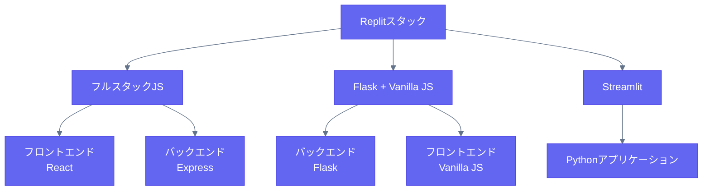

# Replit スタック設定ガイド

Replitでサポートされているスタック設定の総合ガイドへようこそ。このドキュメントでは、利用可能な技術スタック、その構造、および各スタックの使い方について詳しく説明します。

## 利用可能なスタック

- [フルスタックJavaScript (React + Express)](/stacks/fullstack-js.md)
- [Flask + Vanilla JavaScript](/stacks/flask-vanilla.md)
- [Streamlit](/stacks/streamlit.md)

## クイックスタート

各スタックは異なるユースケースに最適化されています：

- **フルスタックJavaScript**: フロントエンドとバックエンドが分離された現代的なWebアプリケーション
- **Flask + Vanilla JS**: サーバーサイドレンダリングを使用する軽量Webアプリケーション
- **Streamlit**: データ中心のアプリケーションとダッシュボード

## ポート設定

すべてのスタックは標準ポートを使用するように設定されています：
- フロントエンドアプリケーション：ポート5000
- バックエンドサービス：ポート8000

## 共通機能

すべてのスタック設定には以下が含まれます：

1. **開発サーバー**
   - ファイル変更時の自動リロード
   - エラー報告
   - デバッグモード

2. **アセット管理**
   - 静的ファイルの提供
   - 画像の最適化
   - CSS/JSのバンドル（該当する場合）

3. **セキュリティ**
   - CORS設定
   - XSS保護
   - CSRF保護

## サンプルプロジェクト

実装例をご覧ください：
- [フルスタックJS例](/examples/fullstack-js-example.md)
- [Flask例](/examples/flask-example.md)
- [Streamlit例](/examples/streamlit-example.md)

## サポート

各スタックの詳細なドキュメントについては、上記のリンクをクリックしてください。各スタックガイドには以下が含まれます：
- 完全なフォルダ構造
- 設定の詳細
- 始め方ガイド
- ベストプラクティス
- よくある落とし穴
