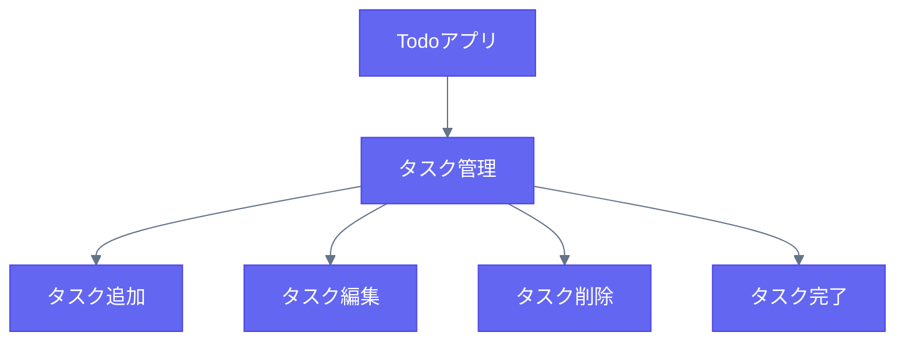

# Flask + Vanilla JavaScript例

## 💻 基本的なTodoアプリケーション

### バックエンド（Flask）

```mermaid
%%{init: {
  'theme': 'base',
  'themeVariables': {
    'primaryColor': '#6366f1',
    'primaryTextColor': '#fff',
    'primaryBorderColor': '#4f46e5',
    'lineColor': '#64748b',
    'secondaryColor': '#f1f5f9',
    'tertiaryColor': '#e2e8f0'
  }
}}%%

graph TD
    A[Todoアプリ] --> B[タスク管理]
    B --> C[タスク追加]
    B --> D[タスク編集]
    B --> E[タスク削除]
    B --> F[タスク完了]
```

実装例と使用方法の詳細はこちらをご覧ください。
