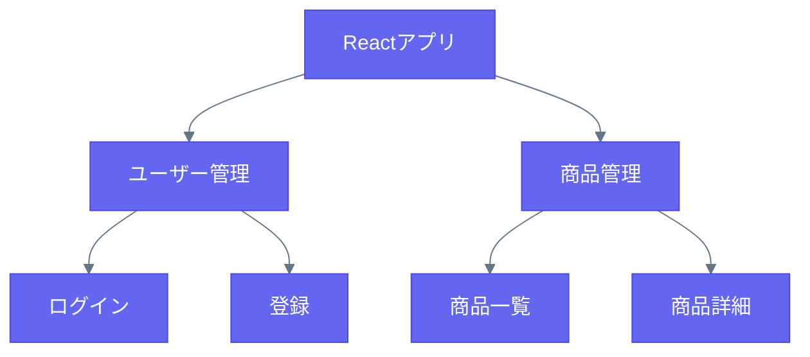

# フルスタックJavaScript例

## 💻 基本的なCRUDアプリケーション

### フロントエンド（React）

```mermaid
%%{init: {
  'theme': 'base',
  'themeVariables': {
    'primaryColor': '#6366f1',
    'primaryTextColor': '#fff',
    'primaryBorderColor': '#4f46e5',
    'lineColor': '#64748b',
    'secondaryColor': '#f1f5f9',
    'tertiaryColor': '#e2e8f0'
  }
}}%%

graph TD
    A[Reactアプリ] --> B[ユーザー管理]
    A --> C[商品管理]
    B --> D[ログイン]
    B --> E[登録]
    C --> F[商品一覧]
    C --> G[商品詳細]
```

実装例と使用方法の詳細はこちらをご覧ください。
