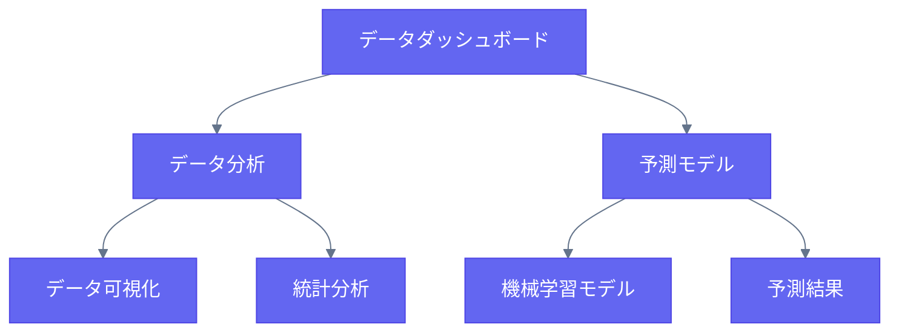

# Streamlit例

## データダッシュボード

```mermaid
%%{init: {
  'theme': 'base',
  'themeVariables': {
    'primaryColor': '#6366f1',
    'primaryTextColor': '#fff',
    'primaryBorderColor': '#4f46e5',
    'lineColor': '#64748b',
    'secondaryColor': '#f1f5f9',
    'tertiaryColor': '#e2e8f0'
  }
}}%%

graph TD
    A[データダッシュボード] --> B[データ分析]
    A --> C[予測モデル]
    B --> D[データ可視化]
    B --> E[統計分析]
    C --> F[機械学習モデル]
    C --> G[予測結果]
```

実装例と使用方法の詳細はこちらをご覧ください。
