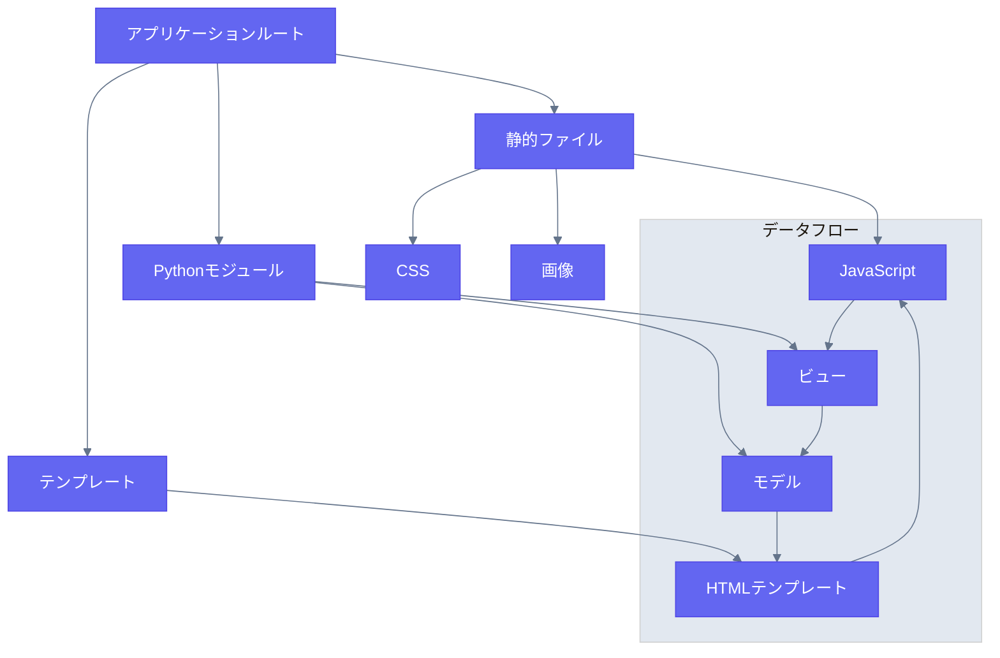

# Flask + Vanilla JavaScript スタック

## 概要

このスタックは、バックエンド処理にFlask、フロントエンドのインタラクティビティにバニラJavaScriptを組み合わせており、軽量なWebアプリケーションに最適です。

## ディレクトリ構造と関係図



### プロジェクト構造
```
flask_app/
├── static/
│   ├── js/
│   ├── css/
│   └── img/
├── templates/
├── models/
├── views/
└── app.py
```
