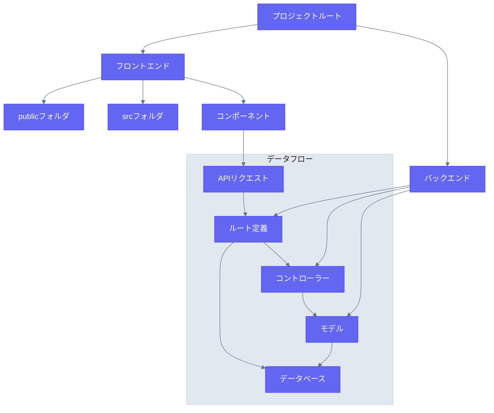

# フルスタックJavaScriptスタック

## 📝 概要

フルスタックJavaScriptスタックは、フロントエンドにReact、バックエンドにExpressを組み合わせ、Webアプリケーション用の最新かつスケーラブルなアーキテクチャを提供します。

## 🗂️ ディレクトリ構造と関係図



### フロントエンド構造
```
frontend/
├── public/
├── src/
│   ├── components/
│   ├── pages/
│   ├── services/
│   └── utils/
└── package.json
```

### バックエンド構造
```
backend/
├── controllers/
├── models/
├── routes/
├── middleware/
└── package.json
```
