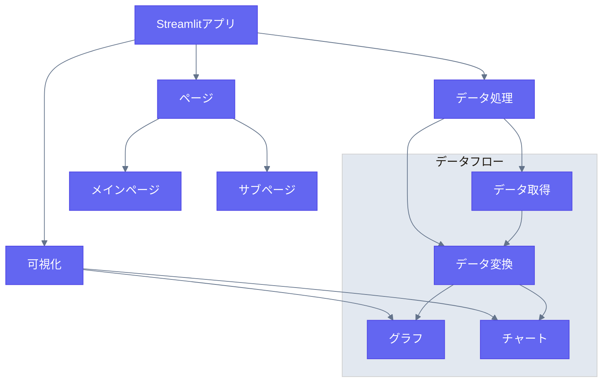

# Streamlit スタック

## 概要

Streamlitは、Pythonを使用してデータアプリケーションやダッシュボードを迅速に開発することを可能にします。

## ディレクトリ構造と関係図



### プロジェクト構造
```
streamlit_app/
├── pages/
├── data/
├── utils/
├── components/
└── app.py
```
